# NCAA Draft Scout — Walkthrough

A visual tour of every page in the app.

---

## Scouting

The scouting page is the core of the app. Search for any player across all 4,000+ D1 prospects.

### Player Card
The player card shows rank, draft score, position, school, conference, year, height, and hometown. All qualifying offensive (orange) and defensive (blue) archetype badges are displayed — hover over any badge for a scouting description.

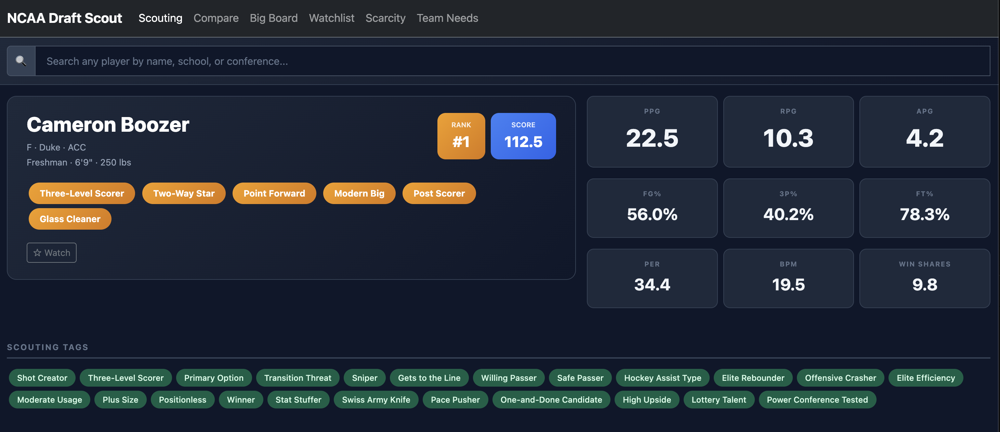

### Scouting Tags, Radar Chart & Notes
Below the player card, scouting tags highlight key traits (green) and concerns (red). The radar chart visualizes six skill dimensions. Scout notes auto-save to the database as you type.

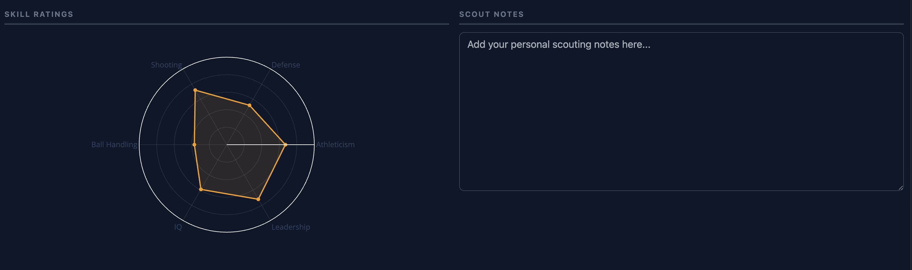

### Full Stats & Advanced Metrics
Expandable sections show the complete stat line (PPG, RPG, APG, shooting splits, etc.) and all advanced metrics (PER, BPM, Win Shares, usage rate, and more).

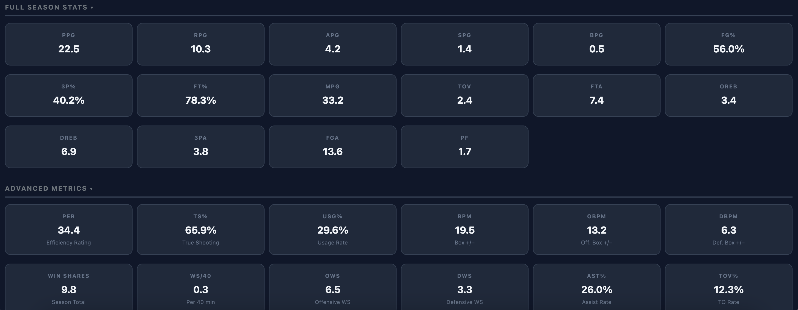

---

## Compare

Search players by name and add them as chips. Compare up to 10 players side by side with an overlaid radar chart and a stat comparison table that highlights the best value per row.

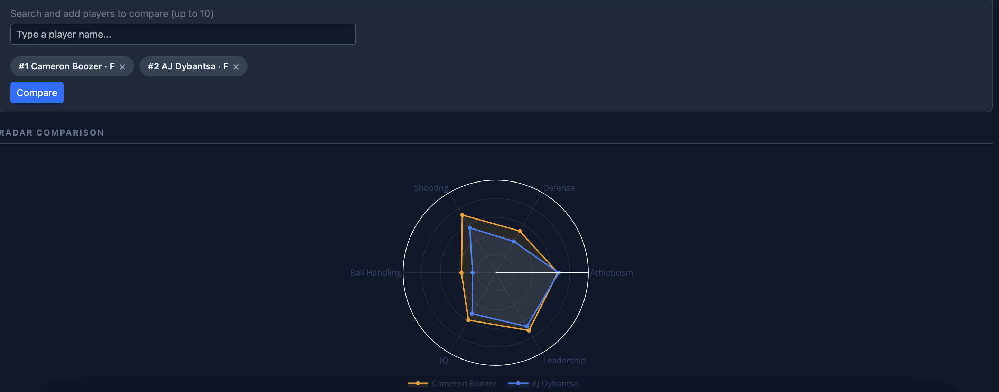

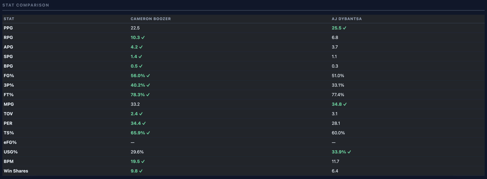

---

## Big Board

The top 200 prospects displayed as a drag-and-drop draft board. Tier headers (Lottery, Late 1st, 2nd Round) update automatically as you reorder. All archetype badges are shown for each player. Filter by position and conference instantly, or limit the view to the top N prospects.

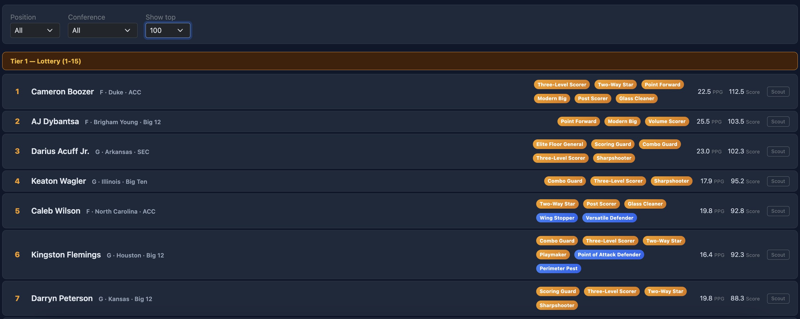

---

## Team Needs

Select the offensive and defensive archetypes your team is missing. The app returns a ranked list of prospects that match, sorted by fit percentage. Matching archetypes glow — non-matching ones are faded. Each result includes key stats and links to the scouting and compare pages.

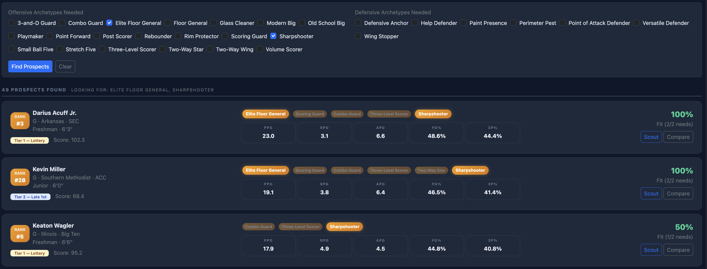

---

## Watchlist

Star players from any page to add them to your persistent watchlist. Each card shows rank, tier, all archetypes, key stats, and a preview of your scout notes. Export the full watchlist as CSV.

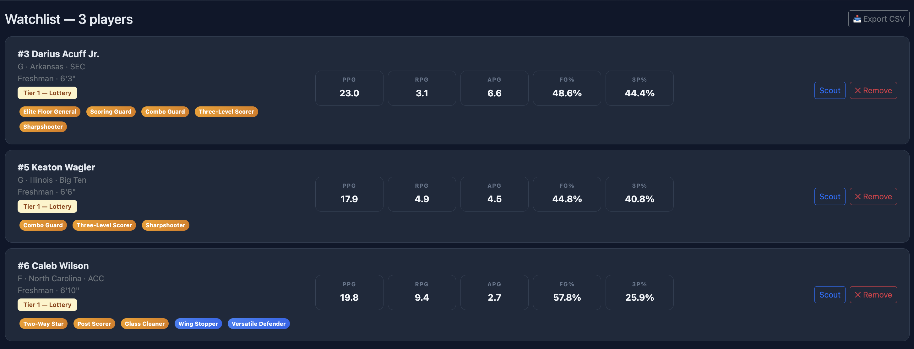

---

## Scarcity Analysis

Analyze the draft class by archetype depth for the top 200 prospects.

### Archetype Guide
A searchable glossary of every offensive and defensive archetype with scouting descriptions and player counts.

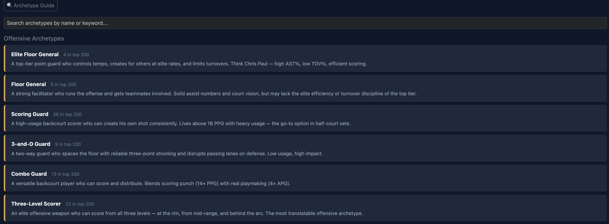

### Browse by Archetype
Filter the top 200 by offensive archetype, defensive archetype, and prospect limit. The table updates instantly client-side.

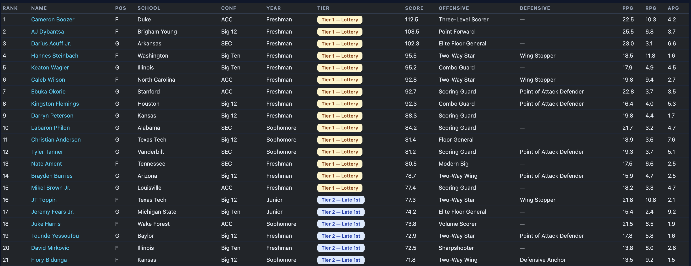

### Depth Chart
Stacked bar chart showing how many prospects fall into each archetype, broken down by tier (Lottery, Late 1st, 2nd Round).

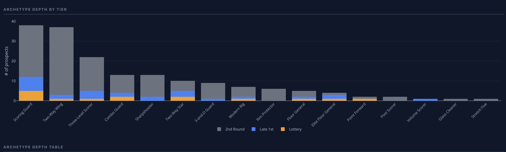

### Depth Table & Draft Score Distribution
The depth table shows total count, tier breakdown, average score, top prospect, and a scarcity signal for each archetype. The box plot shows the spread of draft scores per archetype.

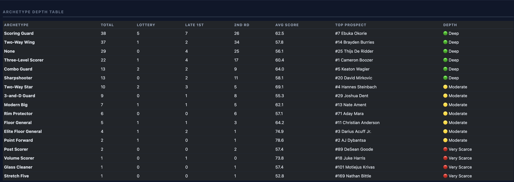

### Positional Gaps & Conference Production
Positional gaps highlight position/archetype combinations with fewer than 3 prospects. The conference table shows which conferences produce which archetypes.

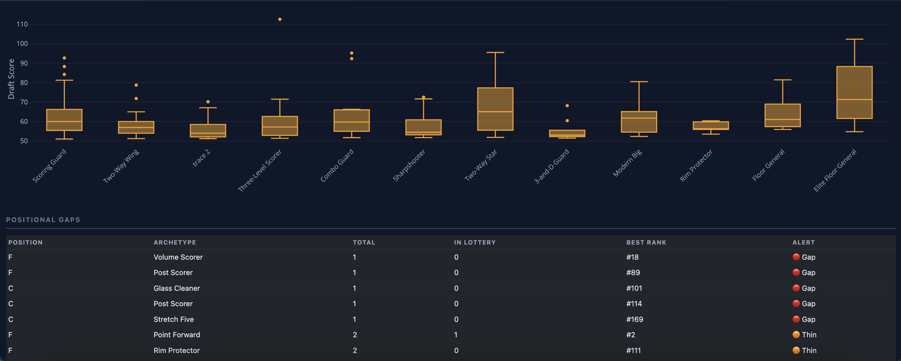

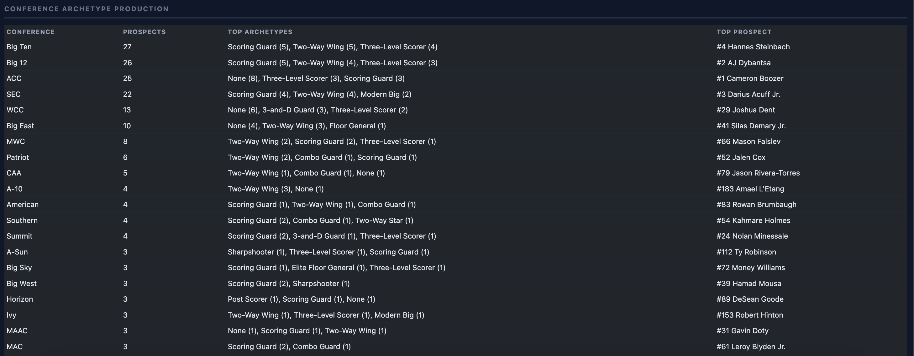
